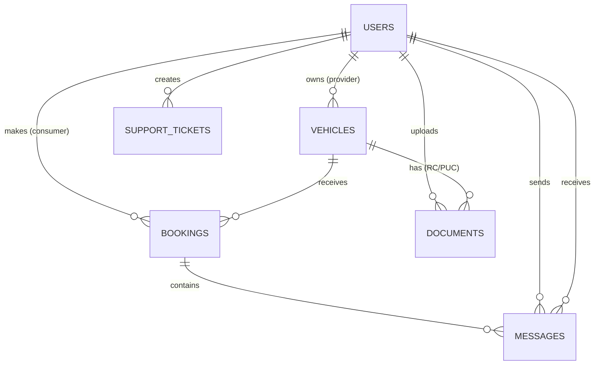

# Rentora — Complete Technical Implementation Guide

## 1. Project Overview

**Rentora** is a full-stack vehicle rental marketplace where consumers can rent cars, bikes, and scooters from providers. It has three user roles: **Consumer** (renter), **Provider** (vehicle owner), and **Admin** (platform manager).

### Tech Stack

| Layer | Technology | Purpose |
|-------|-----------|---------|
| Frontend | React 19 + Vite 8 | Single-page application |
| Styling | Tailwind CSS 4 | Utility-first CSS |
| Icons | Lucide React | SVG icon library |
| HTTP Client | Axios | API requests with interceptors |
| Routing | React Router DOM 7 | Client-side navigation |
| Backend | Express.js 4 | REST API server |
| Database | PostgreSQL | Relational data storage |
| ORM | Sequelize 6 | Database queries & migrations |
| Auth | JSON Web Tokens (JWT) | Stateless authentication |
| Password | bcryptjs | Password hashing (salt rounds: 10) |
| File Upload | Multer | Multipart form handling |
| Validation | Joi | Request schema validation |
| Security | Helmet + CORS | HTTP security headers |
| Logging | Morgan | HTTP request logging |
| Dev Server | Nodemon | Auto-restart on file changes |

### Folder Structure

```
d:\Rent\
├── client/                    # Frontend (React + Vite)
│   ├── src/
│   │   ├── components/        # Reusable UI components
│   │   │   ├── Navbar.jsx     # Top navigation bar
│   │   │   ├── Footer.jsx     # Site footer
│   │   │   └── BookingChatModal.jsx  # Chat popup
│   │   ├── context/
│   │   │   └── AuthContext.jsx # Global auth state
│   │   ├── pages/             # Route-level page components
│   │   │   ├── Home.jsx       # Landing page
│   │   │   ├── Login.jsx      # Login form
│   │   │   ├── Register.jsx   # Registration form
│   │   │   ├── Vehicles.jsx   # Browse/search vehicles
│   │   │   ├── VehicleDetail.jsx # Single vehicle + booking
│   │   │   ├── Dashboard.jsx  # User/Provider/Admin dashboard
│   │   │   ├── AddVehicle.jsx # Provider: list a vehicle
│   │   │   ├── EditVehicle.jsx # Provider: edit vehicle
│   │   │   ├── Documents.jsx  # Upload identity documents
│   │   │   ├── Verifications.jsx # Admin: verify documents
│   │   │   ├── ProviderEarnings.jsx # Provider earnings
│   │   │   ├── Support.jsx    # User support tickets
│   │   │   └── AdminSupport.jsx # Admin: manage tickets
│   │   ├── services/
│   │   │   └── api.js         # Axios instance + all API calls
│   │   ├── App.jsx            # Router + route definitions
│   │   ├── main.jsx           # React entry point
│   │   └── index.css          # Global styles
│   └── vite.config.js         # Vite dev server + proxy
│
└── server/                    # Backend (Express + PostgreSQL)
    ├── src/
    │   ├── config/
    │   │   ├── db.js          # Sequelize connection + sync
    │   │   └── env.js         # Environment variables
    │   ├── middleware/
    │   │   ├── auth.middleware.js     # JWT verification
    │   │   ├── role.middleware.js     # Role-based access
    │   │   ├── upload.middleware.js   # Multer file upload
    │   │   ├── validate.middleware.js # Joi validation
    │   │   └── error.middleware.js    # Global error handler
    │   ├── models/            # Sequelize model definitions
    │   │   ├── index.js       # Model associations
    │   │   ├── User.js
    │   │   ├── Vehicle.js
    │   │   ├── Booking.js
    │   │   ├── Document.js
    │   │   ├── SupportTicket.js
    │   │   └── Message.js
    │   ├── modules/           # Feature modules
    │   │   ├── auth/          # Login, Register, Profile
    │   │   ├── users/         # User management
    │   │   ├── vehicles/      # Vehicle CRUD
    │   │   ├── bookings/      # Booking lifecycle
    │   │   ├── documents/     # Document upload/verify
    │   │   ├── payments/      # Payment processing
    │   │   ├── admin/         # Admin dashboard + actions
    │   │   ├── support/       # Support ticket system
    │   │   └── chat/          # Booking-based messaging
    │   ├── utils/
    │   │   ├── ApiError.js    # Custom error class
    │   │   ├── ApiResponse.js # Standardized responses
    │   │   ├── asyncHandler.js # Async error wrapper
    │   │   ├── helpers.js     # Price calc, validators
    │   │   └── ocr.js         # Document OCR extraction
    │   ├── app.js             # Express app configuration
    │   └── server.js          # Server entry point
    └── uploads/               # Uploaded files (local disk)
```

---

## 2. How the Frontend and Backend Connect

### Dev Server Proxy (vite.config.js)

The Vite dev server runs on port **3000** and proxies API requests to the Express server on port **5000**:

```
Browser → localhost:3000/api/vehicles → Vite Proxy → localhost:5000/api/vehicles
Browser → localhost:3000/uploads/img.jpg → Vite Proxy → localhost:5000/uploads/img.jpg
```

This means the frontend code just calls `/api/...` without hardcoding the server URL.

### API Service Layer (client/src/services/api.js)

All HTTP calls go through a single Axios instance with two interceptors:

**Request Interceptor:** Automatically attaches the JWT token from `localStorage` to every request:
```
Authorization: Bearer <token>
```

**Response Interceptor:** 
- Unwraps `res.data` so callers get the response body directly
- On 401 errors: clears localStorage and redirects to `/login`

The file exports grouped API objects: `authAPI`, `vehicleAPI`, `bookingAPI`, `documentAPI`, `paymentAPI`, `adminAPI`, `supportAPI`, `chatAPI`.

---

## 3. Database Design (PostgreSQL + Sequelize)

### Connection Setup

Sequelize connects using environment variables (DB_HOST, DB_NAME, DB_USER, DB_PASSWORD). In **development mode**, it runs `sequelize.sync({ alter: true })` on startup, which auto-creates/modifies tables to match model definitions without dropping data.

### Entity Relationship Diagram



### Table: `users`

| Column | Type | Description |
|--------|------|-------------|
| id | INTEGER PK | Auto-increment |
| name | VARCHAR(100) | Full name |
| email | VARCHAR(255) UNIQUE | Login email |
| password | VARCHAR(255) | bcrypt hash |
| role | ENUM | `consumer`, `provider`, `admin` |
| phone | VARCHAR(20) | Optional phone |
| avatar | VARCHAR(500) | Profile picture URL |
| verified | BOOLEAN | Document verification status |
| banned | BOOLEAN | Account banned by admin |
| ban_reason | VARCHAR(500) | Why banned |
| created_at | TIMESTAMP | Auto-managed |
| updated_at | TIMESTAMP | Auto-managed |

**Password Hook:** Before creating or updating a user, bcrypt automatically hashes the password with 10 salt rounds. The raw password is never stored.

### Table: `vehicles`

| Column | Type | Description |
|--------|------|-------------|
| id | INTEGER PK | Auto-increment |
| owner_id | INTEGER FK → users | Provider who listed it |
| title | VARCHAR(200) | Display name |
| type | ENUM | `car`, `bike`, `scooter` |
| brand | VARCHAR(100) | e.g., "Honda" |
| model | VARCHAR(100) | e.g., "City" |
| year | INTEGER | Manufacturing year |
| price_per_hour | DECIMAL(10,2) | Hourly rate in ₹ |
| price_per_day | DECIMAL(10,2) | Daily rate in ₹ |
| location | VARCHAR(300) | Pickup address |
| images | JSON | Array of image URLs |
| availability | BOOLEAN | Currently available? |
| verified | BOOLEAN | Admin approved? |
| specs | JSON | Extra specs (fuel, seats, etc.) |
| description | TEXT | Long description |

### Table: `bookings`

| Column | Type | Description |
|--------|------|-------------|
| id | INTEGER PK | Auto-increment |
| user_id | INTEGER FK → users | Consumer who booked |
| vehicle_id | INTEGER FK → vehicles | Vehicle being rented |
| start_date | TIMESTAMP | Rental start |
| end_date | TIMESTAMP | Rental end |
| total_price | DECIMAL(10,2) | Calculated price |
| status | ENUM | `pending`→`confirmed`→`active`→`completed` or `cancelled` |
| payment_id | VARCHAR(255) | Stripe payment ID |
| payment_status | ENUM | `pending`, `paid`, `refunded`, `failed` |
| cancellation_reason | VARCHAR(500) | Why cancelled |

### Table: `documents`

| Column | Type | Description |
|--------|------|-------------|
| id | INTEGER PK | Auto-increment |
| user_id | INTEGER FK → users | Uploader |
| vehicle_id | INTEGER FK → vehicles | Nullable, for RC/PUC docs |
| type | ENUM | `DL`, `RC`, `PUC`, `Aadhar`, `PAN`, `VoterID`, `RationCard` |
| file_url | VARCHAR(500) | Path to uploaded file |
| extracted_data | JSON | OCR-extracted fields |
| status | ENUM | `pending`, `verified`, `rejected` |
| expiry_date | DATE | Document expiration |
| verified_by_id | FK → users | Admin who verified |
| rejection_reason | VARCHAR(500) | Why rejected |

### Table: `support_tickets`

| Column | Type | Description |
|--------|------|-------------|
| id | INTEGER PK | Auto-increment |
| user_id | INTEGER FK → users | Ticket creator |
| subject | VARCHAR(255) | Ticket subject |
| description | TEXT | Issue description |
| status | ENUM | `open`, `resolved` |
| admin_reply | TEXT | Admin's response |
| sender_name | VARCHAR(100) | Denormalized sender name |
| sender_email | VARCHAR(255) | Denormalized sender email |

### Table: `messages`

| Column | Type | Description |
|--------|------|-------------|
| id | INTEGER PK | Auto-increment |
| booking_id | INTEGER FK → bookings | Chat belongs to this booking |
| sender_id | INTEGER FK → users | Who sent the message |
| receiver_id | INTEGER FK → users | Who receives the message |
| content | TEXT | Message text |
| created_at | TIMESTAMP | When sent |

### Model Associations (models/index.js)

```
User  ──hasMany──→  Vehicle     (owner_id)
User  ──hasMany──→  Booking     (user_id)
User  ──hasMany──→  Document    (user_id)
User  ──hasMany──→  SupportTicket (user_id)
User  ──hasMany──→  Message     (sender_id, receiver_id)

Vehicle ──hasMany──→ Booking    (vehicle_id)
Vehicle ──hasMany──→ Document   (vehicle_id)

Booking ──hasMany──→ Message    (booking_id)
```

---

## 4. Authentication System

### How Login Works (Step by Step)

```
1. User types email + password on Login.jsx
2. AuthContext.login() calls authAPI.login({email, password})
3. Axios sends POST /api/auth/login with JSON body
4. Server: auth.controller.login → auth.service.login
5. Service: Finds user by email → bcrypt.compare(password, hash)
6. If match: Signs a JWT with { userId } using secret key, expiry 7 days
7. Returns { user: {id,name,email,role,...}, token: "eyJ..." }
8. Frontend: Stores token in localStorage('rentora_token')
9. Frontend: Stores user JSON in localStorage('rentora_user')
10. AuthContext state updates → UI re-renders as logged-in
```

### How Protected Routes Work

**Frontend (App.jsx):** `ProtectedRoute` checks `isAuthenticated` from AuthContext. If false, redirects to `/login`. If roles are specified (e.g., `['admin']`), checks `user.role`.

**Backend (auth.middleware.js):** Every protected API route uses `authenticate` middleware:
1. Extracts token from `Authorization: Bearer <token>` header
2. Verifies token with `jwt.verify(token, secret)`
3. Looks up user by `decoded.userId` in database
4. Checks if user is banned
5. Attaches `req.user` and `req.userId` for controllers to use

**Role Middleware (role.middleware.js):** `authorize('provider', 'admin')` checks if `req.user.role` is in the allowed list.

---

## 5. Booking System — Complete Flow

### Step 1: Consumer Browses Vehicles

```
Frontend: Vehicles.jsx → vehicleAPI.getAll({type, search, page})
Backend:  GET /api/vehicles → vehicle.controller → vehicle.service
          Queries vehicles table with filters, includes owner info
          Only shows vehicles where verified=true AND availability=true
```

### Step 2: Consumer Views Vehicle Detail

```
Frontend: VehicleDetail.jsx → vehicleAPI.getById(id)
Backend:  GET /api/vehicles/:id → includes owner name, email, phone
Frontend: Shows pricing, specs, images, location, booking form
```

### Step 3: Consumer Creates Booking

```
Frontend: Selects startDate + endDate → bookingAPI.create({vehicleId, startDate, endDate})
Backend:  POST /api/bookings (consumer role required)
          
  booking.service.createBooking():
  1. Validates vehicle exists, is available, is verified
  2. Prevents booking own vehicle
  3. Checks for date conflicts with existing bookings
  4. Calculates price:
     - If duration ≥ 24 hours: days × pricePerDay
     - If duration < 24 hours: hours × pricePerHour
  5. Creates booking with status='pending', paymentStatus='pending'
```

### Step 4: Provider Accepts/Declines

```
Frontend: Dashboard.jsx (provider view) shows pending bookings
          Provider clicks "Accept" → bookingAPI.updateStatus(id, {status:'confirmed'})
Backend:  PUT /api/bookings/:id/status
          
  booking.service.updateBookingStatus():
  1. Validates state transition: pending → confirmed ✓ (or cancelled)
  2. Only vehicle owner can confirm
  3. Updates booking status
```

### Step 5: Booking Lifecycle

```
pending → confirmed → active → completed
              ↓
           cancelled (by either party)

Valid transitions enforced by server:
  pending:   → confirmed, cancelled
  confirmed: → active, cancelled  
  active:    → completed
  completed: (terminal)
  cancelled: (terminal)
```

### Step 6: Dashboard Stats

```
GET /api/bookings/stats → Returns counts: total, active, completed, cancelled, pending, totalRevenue
For providers: Calculates stats across all their vehicles
For consumers: Calculates stats for their bookings only
```

---

## 6. Chat System — How It Works

### Architecture: Polling-Based Messaging

The chat system uses **HTTP polling** (not WebSockets). The frontend polls every 3 seconds for new messages.

### Database Design

Each chat conversation is tied to a **booking**. Only the consumer (booking creator) and the provider (vehicle owner) can participate.

### How Sending a Message Works

```
1. Consumer clicks "Chat" button on a confirmed booking
2. BookingChatModal.jsx opens as a modal overlay
3. On mount: GET /api/chat/:bookingId → fetches all messages
4. Starts setInterval(fetchMessages, 3000) to poll for new messages
5. User types message → handleSend()

Frontend (optimistic UI):
  a. Clears input immediately
  b. Adds temporary message to local state (shows instantly)
  c. Sends POST /api/chat/:bookingId with {content}
  d. On success: re-fetches all messages (replaces optimistic msg)
  e. On failure: shows alert, re-fetches to revert

Backend (chat.controller.js):
  sendMessage():
  1. Finds booking by ID, includes vehicle.owner_id
  2. Authorization: checks if sender is consumer OR provider
  3. Auto-determines receiverId:
     - If sender is the consumer → receiver is vehicle owner
     - If sender is the vehicle owner → receiver is consumer
  4. Creates Message record with {bookingId, senderId, receiverId, content}
  5. Returns populated message with sender name/role/avatar
```

### How Messages Display

```
Frontend renders each message:
- msg.senderId === user.id → Right-aligned black bubble (my message)
- msg.senderId !== user.id → Left-aligned gray bubble with avatar
- Shows sender name on first message in a group
- Shows timestamp below each message
- Auto-scrolls to bottom when new messages arrive
```

### Chat Access Control

The Chat button only appears for bookings with status: `confirmed`, `active`, or `completed`. The backend independently verifies that the requesting user is either the booking's consumer or the vehicle's owner.

---

## 7. Document Upload & Verification System

### Supported Document Types

| Type | Purpose | For |
|------|---------|-----|
| DL (Driving License) | Identity + driving proof | Consumer |
| Aadhar | Government ID | Consumer |
| PAN | Tax ID | Consumer |
| VoterID | Government ID | Consumer |
| RationCard | Government ID | Consumer |
| RC (Registration Certificate) | Vehicle ownership proof | Provider (per vehicle) |
| PUC (Pollution Under Control) | Emission certificate | Provider (per vehicle) |

### Upload Flow

```
1. User goes to Documents.jsx → clicks "Upload Document"
2. Selects document type, optionally links to a vehicle (for RC/PUC)
3. Selects file (JPEG, PNG, WebP, PDF — max 5MB)
4. Frontend: documentAPI.upload(formData) — sends as multipart/form-data

Backend:
  a. upload.middleware.js (Multer) saves file to server/uploads/ directory
     Filename format: document-{timestamp}-{random}.{ext}
  b. document.controller.uploadDocument():
     - Constructs fileUrl: /uploads/{filename}
     - document.service creates Document record with status='pending'
  c. File is accessible via: http://localhost:5000/uploads/{filename}
     (proxied through Vite in dev)
```

### Admin Verification Flow

```
1. Admin navigates to Verifications.jsx
2. Fetches GET /api/documents/pending → paginated list
3. Admin reviews document image, clicks "Verify" or "Reject"
4. PUT /api/documents/:id/verify with {status:'verified'} or {status:'rejected', reason:'...'}

Backend:
  - Sets document.status, document.verifiedById (admin's user ID)
  - If rejected, stores rejectionReason
  - If all required docs verified → user.verified = true
```

---

## 8. Support Ticket System

### User Flow (Consumer or Provider)

```
1. User clicks "Support" in navbar → Support.jsx
2. Clicks "New Ticket" → fills subject + description
3. POST /api/support → creates ticket with:
   - userId from JWT
   - senderName, senderEmail (fetched from User table and denormalized)
   - status: 'open'
4. User sees list of their tickets with status and admin replies
```

### Admin Flow

```
1. Admin goes to AdminSupport.jsx (/dashboard/support)
2. GET /api/support → fetches ALL tickets with user associations
3. For each ticket: shows user info (with senderName/senderEmail as fallback)
4. Admin types reply → PUT /api/support/:id with {adminReply, status}
5. Updates ticket.adminReply and optionally ticket.status to 'resolved'
```

### How Admin Reply Shows to User

When the user views their tickets on Support.jsx, each ticket object includes `adminReply`. If it's not null, the UI renders it in a green-bordered box labeled "Admin Reply".

---

## 9. Vehicle Management

### Provider Lists a Vehicle

```
1. Provider goes to AddVehicle.jsx
2. Fills form: title, type, brand, model, year, prices, location, description
3. Uploads images (up to 10) via POST /api/vehicles/images (multipart)
   - Returns array of URLs like ["/uploads/images-123.jpg", ...]
4. Submits form: POST /api/vehicles with all data + image URLs
5. Vehicle created with verified=false (needs admin approval)
```

### Admin Approves Vehicle

```
Admin Dashboard → sees unverified vehicles
PUT /api/admin/vehicles/:id/approve → sets vehicle.verified = true
Only verified vehicles appear in public browse listings
```

### Price Calculation Logic (helpers.js)

```javascript
if (duration >= 24 hours) {
  totalPrice = ceil(hours / 24) × pricePerDay
} else {
  totalPrice = hours × pricePerHour
}
```

---

## 10. Admin Dashboard

### What Admin Can Do

| Action | API Endpoint | Description |
|--------|-------------|-------------|
| View Stats | GET /api/admin/dashboard | Total users, vehicles, bookings, revenue |
| Manage Users | GET /api/admin/users | List all users with filters |
| Ban User | PUT /api/admin/users/:id/ban | Set banned=true with reason |
| Unban User | PUT /api/admin/users/:id/unban | Set banned=false |
| Approve Vehicle | PUT /api/admin/vehicles/:id/approve | Set verified=true |
| Remove Vehicle | DELETE /api/admin/vehicles/:id | Delete vehicle listing |
| Verify Documents | GET /api/admin/verifications | Pending document queue |
| Support Tickets | GET /api/support | View/reply to all tickets |
| Revenue Report | GET /api/admin/revenue | Financial analytics |

---

## 11. Security Architecture

### Middleware Pipeline (for every request)

```
Request → Helmet (security headers) → CORS → JSON Parser → Morgan (logging)
  → Route Matching → authenticate (JWT) → authorize (role check) 
  → validate (Joi schema) → Controller → Response
  → errorHandler (catches all thrown errors)
```

### Key Security Features

1. **Helmet:** Sets security headers (X-Frame-Options, CSP, etc.)
2. **CORS:** Allows cross-origin requests (configured for dev)
3. **JWT:** Stateless auth, 7-day expiry, signed with secret
4. **bcrypt:** Passwords hashed with 10 salt rounds, never stored as plaintext
5. **Joi Validation:** Every mutation endpoint validates request body/params
6. **Role Authorization:** Endpoints restricted by user role
7. **File Upload Limits:** 5MB max, only allowed MIME types
8. **Banned User Check:** Auth middleware blocks banned users on every request

---

## 12. Frontend Routing & Access Control

| Route | Component | Access |
|-------|-----------|--------|
| `/` | Home | Public |
| `/login` | Login | Guest only |
| `/register` | Register | Guest only |
| `/vehicles` | Vehicles | Public |
| `/vehicles/:id` | VehicleDetail | Public |
| `/dashboard` | Dashboard | Authenticated |
| `/dashboard/add-vehicle` | AddVehicle | Provider, Admin |
| `/dashboard/edit-vehicle/:id` | EditVehicle | Provider, Admin |
| `/dashboard/documents` | Documents | Authenticated |
| `/dashboard/earnings` | ProviderEarnings | Provider, Admin |
| `/dashboard/verifications` | Verifications | Admin |
| `/dashboard/support` | AdminSupport | Admin |
| `/support` | Support | Authenticated |

### AuthContext (Global State)

The `AuthProvider` wraps the entire app. It provides:
- `user` — current user object (or null)
- `token` — JWT string (or null)
- `isAuthenticated` — boolean
- `login(email, password)` — calls API, stores in localStorage
- `register(data)` — calls API, stores in localStorage
- `logout()` — clears localStorage and state

On page refresh, it reads from `localStorage` first, then validates the token by fetching the profile from the server.

---

## 13. How to Run the Project

### Prerequisites
- Node.js v18+
- PostgreSQL running locally
- Database named `rentora` created

### Environment Variables (server/.env)
```
DB_HOST=localhost
DB_PORT=5432
DB_NAME=rentora
DB_USER=postgres
DB_PASSWORD=your_password
JWT_SECRET=your-secret-key
PORT=5000
```

### Start Backend
```bash
cd server
npm install
cd src
nodemon server.js
# Runs on http://localhost:5000
# Auto-creates all tables on first run (sync alter)
```

### Start Frontend
```bash
cd client
npm install
npm run dev
# Runs on http://localhost:3000
# Proxies /api/* to localhost:5000
```

### Common Issue: Port 5000 Already in Use
```bash
npx kill-port 5000    # Kill zombie process
nodemon server.js     # Restart
```
